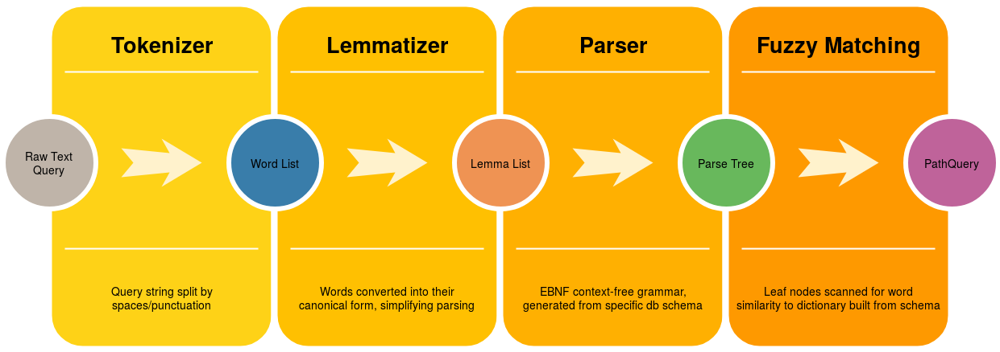
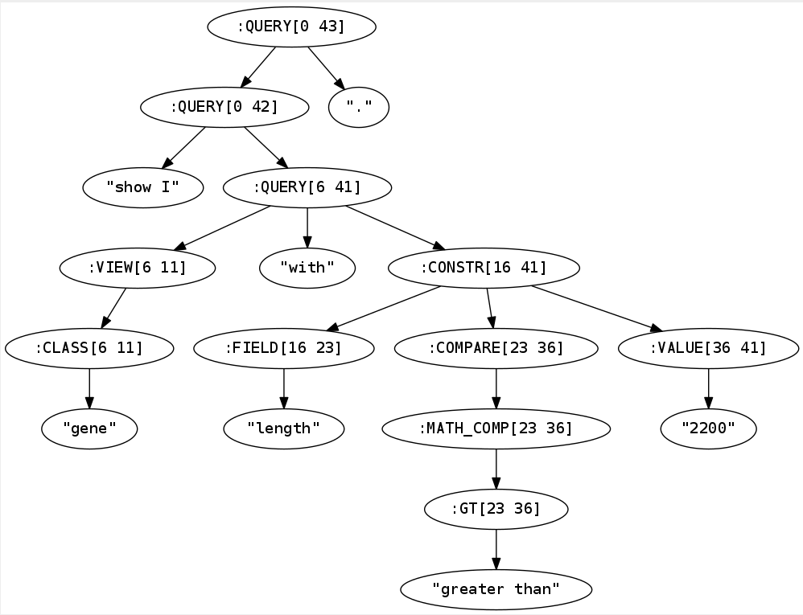

# intermine-nlp
Welcome to intermine-nlp!

intermine-nlp is a library for generating InterMine PathQuery queries (JSON or XML) from natural language queries. There are many queries which are difficult or impossible to word in English, let alone translate into a PathQuery. For this project, it’s only worth targeting relatively simple query structures which users of the natural language interface are likely to care about.

Intermine is a database generation tool for genetic datasets. This library aims to provide a natural language front-end to Intermine, allowing users to interact with the database without needing to craft complex PathQuery queries.

InterMine databases are queried using a GraphQL-like query language called PathQuery, formatted in either JSON or XML. A web-based graphical tool for creating queries exists, but is still rather complex and unintuitive to use for those unfamiliar with the system. The maintainers of the InterMine project believe that an interface more similar to natural language would lower the barrier to entry for non-developers. Therefore, I’m proposing to work on adding a natural language to structured query translator, allowing users to more easily interact with their database.

For further information, refer to my (first) [article](https://medium.com/@jakemacneal/intermine-nlp-nlp-query-answering-for-intermine-e8dfdfb64b9) on medium.

I (Jake) had the opportunity to work on this project as a recipient of a Google Summer of Code (2018) stipend.
Coming soon: recap article for my Google Summer of Code, along with a small live demo.


## Current Status
Most of the work to date has been at the parser level and below, developing a solid technical base
for the query generation portion of the pipeline. That will depend heavily on fuzzy string comparison logic,
which is certainly non-trivial. 



Since the last pull request, the loop has been "closed" so to speak: basic PathQuery generation is working. However, there are significant
limitations and areas of improvement which need to be investigated (see the [Future Work](#future-work) section). Among these limitations are:
* Fails if unable to parse input using static grammar (architectural)
* Doesn't recognize words acting as both path and operator, such as "longer" (fixable)
* Fuzzy matching doesn't recognize many-to-one mappings, such as "primary IDs"->"primaryIdentifier" (fixable, non-trivial)


## Requirements
Make sure you have a working installation of Java (version 8 or later) on your system. Additionally, you'll need [leiningen](https://leiningen.org/),
the most commonly used build tool for Clojure applications. 


## Demo Application
To build a .jar file which demonstrates parse tree generation, run the command `lein uberjar`.
You can run the standalone jar with the command `java -jar target/uberjar/intermine-nlp-0.1.0-SNAPSHOT-standalone.jar`
This simple program is meant to demonstrate the current capabilities of the parser pipeline.
Currently, it only performs parse tree generation, but soon it will also attempt to return a
PathQuery translation of your query. It is not especially flexible, so keep your expectations
low.


## Build
Coming soon: require from Clojars!

For now: after git cloning this repository, `cd` into the directory and run `lein install`.
Now, you'll be able to use intermine-nlp from any clojure project on your system, just run
`(require '[intermine-nlp.core :as core])` from a leiningen repl.


## Usage
The most interesting namespaces for external use are core, nlp, query, and fuzzy. You can read more about those and others [here](src/intermine_nlp/README.md).

To load a model and construct a parser pipeline:

```
(require '[intermine-nlp.core :as core])
(require '[intermine-nlp.model :as model])
(def fly-service {:root "www.flymine.org/query"})
(def fly-model (model/fetch-model fly-service))
(def fly-parser (core/parser-pipeline fly-model))

;;; Bad query
(parser-pipeline "This is a test sentence that does not parse.")
;;; Good queries
(parser-pipeline "Which genes have names like GOPHER?")
(parser-pipeline "Show me genes with length greater than 2200")
```
Here's a visualization of the parse tree generated for that last query:

And here's the resulting generated PathQuery:
```
{:from "Gene", :select ["Gene.secondaryIdentifier" "Gene.symbol" "Gene.primaryIdentifier" "Gene.organism.name"], :where [{:path "Gene.length", :op ">", :value "2200"}]}
```


## Test
To run unit tests, just execute (assuming leiningen is installed) `lein test`, from the root project
directory. Expect this to take around a minute, as the JVM has to be started up, and the full
test suit involves fetching some values from remote servers. Alternatively, you can run the test
suite from within a currently-running Clojure session. This can be done rather inconveniently from
within the leiningen/Clojure REPL by require each namespace in test/intermine-nlp. However, your
environment probably supports something more automated. In Emacs using Cider, I can run `M-x cider-test-run-project-tests`
(`C-c C-t p`) to run all tests in all test namespaces, or `M-x cider-test-run-ns-tests` (`C-c C-t n`)
to run all tests in the current test namespace.


## Future Work
Ranked in ascending order of difficulty (and by urgency in descending order, approximately):

* Improve test coverage of existing codebase
* Parse sorting ("..., sort by length ascending.")
* Multi-word fuzzy matching of raw input, such as "primary IDs"->"primaryIdentifier" (consider clojure.math.combinatorics)
* Further improvement of grammar (resources/grammar.bnf) and query/parse functionality, manually covering more constructions and schema-dependant special cases
* Collect more human translation data, incorporating it more efficiently/automatically in tests
* NLP grammatical parsing (treebank?) as fallback mode
* Incorporate statistical, modern NLP algorithms; requires much more training data
